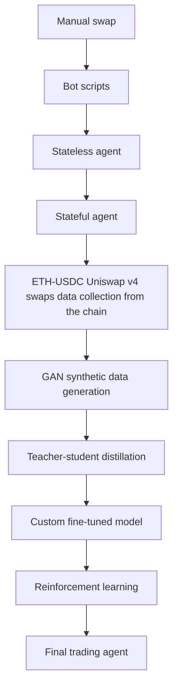

<Info>
  Previous section: [AI trading agent: Stack](/docs/ai-trading-agent-stack)
</Info>

<Note>
  Project repository: [Web3 AI trading agent](https://github.com/web3-ai-trading-agent)
</Note>

<Tip>
  This is the pipeline overview with little to no hands-on. If you are looking to get your feet wet, feel free to skip this section.
</Tip>

This section maps out our complete development pipeline, tracing the evolution from manual trading to autonomous AI agents. Our approach mirrors the broader Web3 industry progression while giving you hands-on experience with each technological advancement.

## The three-stage evolution

Our tutorial follows the natural progression of Web3 trading, letting you experience how the industry evolved from manual interactions to scripted bots to an LLM agent.

### Stage 1: Manual trading era
**Direct MetaMask interactions**

<Info>
  This one might be of interest to you likely only if you've never done a swap on blockchain before. Otherwise feel free to skip this section.
</Info>

The foundation of Web3 trading begins with manual transactions. Users connect their wallets directly to decentralized exchanges, manually selecting trading pairs, amounts, and executing transactions.

To do a manual ETH-USDC swap on the exact Uniswap V4 pool that we use in a bot script and in the trading agent later in the tutorial, do the following:

1. Install [MetaMask](https://metamask.io/).
2. Connect to the BASE mainnet. See [Chainstack tooling](https://docs.chainstack.com/docs/base-tooling#metamask) or use [Chainlist](https://chainlist.org/).
3. Get some ETH on your BASE account.
4. Do the [ETH-USDC pool](https://app.uniswap.org/explore/pools/base/0x96d4b53a38337a5733179751781178a2613306063c511b78cd02684739288c0a) swap.

### Stage 2: Bot automation era
**Programmatic ETH-USDC swaps**

The DeFi summer of 2020 sparked widespread adoption of trading bots. Developers began automating repetitive tasks, leading to the MEV (maximum extractable value) revolution.

<Info>
  Make sure you have the private key and the RPC node endpoints set up in the `config.py` file. And then run the `usdc_to_eth_swap.py` and `eth_to_usdc_swap.py` respectively to get the Uniswap V4 programmatic swap experience.
</Info>

Bot scripts excel at executing predefined strategies but lack adaptability to changing market conditions.

### Stage 3: AI agent era
**Intelligent decision-making systems**

The current frontier combines traditional Web3 infrastructure with artificial intelligence. AI agents analyze market data, adapt to changing conditions, and execute complex strategies autonomously.

## Development pipeline architecture

Our pipeline progresses through increasingly sophisticated implementations, each building upon previous foundations.

## Pipeline breakdown

Each stage in our pipeline serves a specific learning objective while building toward the final autonomous trading system.

### Foundation: Manual swap implementation
**Learning objective:** Understand basic Uniswap V4 mechanics

You'll start by executing ETH-USDC swaps manually through MetaMask, then replicate the same operations programmatically.

### Level 1: Bot script automation
**Learning objective:** Script a bot to do one-off ETH-USDC swaps

Transform manual operations into automated scripts that execute swaps based on predefined rules.

### Level 2: Stateless AI agent
**Learning objective:** Integrate AI decision making

Replace static rules with dynamic AI-driven decisions using local language models. The stateless agent:

- Queries Ollama models for trading decisions
- Processes real-time market data
- Executes trades based on AI recommendations
- Operates without memory between decisions

### Level 3: Stateful AI agent  
**Learning objective:** Add memory and context management

Enhance the agent with persistent memory and strategy tracking. The stateful agent:

- Maintains trading history and performance metrics
- Tracks long-term strategy effectiveness
- Manages context window limitations
- Summarizes performance when memory fills up

### Level 4: Data collection and processing
**Learning objective:** Collect raw Uniswap V4 data and prepare for synthetic data generation

Collect real on-chain data from BASE mainnet to fine tune custom models:

- Historical swap event extraction
- Data preprocessing for synthetic data generation

### Level 5: Synthetic data generation
**Learning objective:** Create enhanced training datasets

Use generative adversarial networks (GANs) to create synthetic trading data:

- Inspired by [Generative Adversarial Neural Networks for Realistic Stock Market Simulations](https://thesai.org/Downloads/Volume15No3/Paper_5-Generative_Adversarial_Neural_Networks.pdf)
- GAN architecture for time series data
- WGAN-GP training for stable convergence
- Data quality validation and verification

### Level 6: Model distillation pipeline
**Learning objective:** Create custom trading models

Distill knowledge from large teacher models into efficient student models:

- [Chain of Draft](https://arxiv.org/abs/2502.18600) prompting for efficiency
- QwQ 32B teacher model via [OpenRouter](https://openrouter.ai/)
- Qwen 2.5 3B student model fine-tuning
- LoRA adaptation for parameter efficiency

### Level 7: Reinforcement learning enhancement
**Learning objective:** Optimize strategies through trial and error

Stack reinforcement learning on top of supervised fine-tuning:

- Custom Gymnasium trading environment
- DQN (Deep Q-Network) strategy optimization
- Experience replay for stable learning
- Multi-layer fine-tuning

### Final system: Autonomous trading agent
**Learning objective:** Deploy your trading system

Integrate all components into an autonomous trading system:

- Custom fine-tuned models with domain expertise
- Real-time market data processing
- Risk management and position sizing
- Performance monitoring and strategy adaptation
