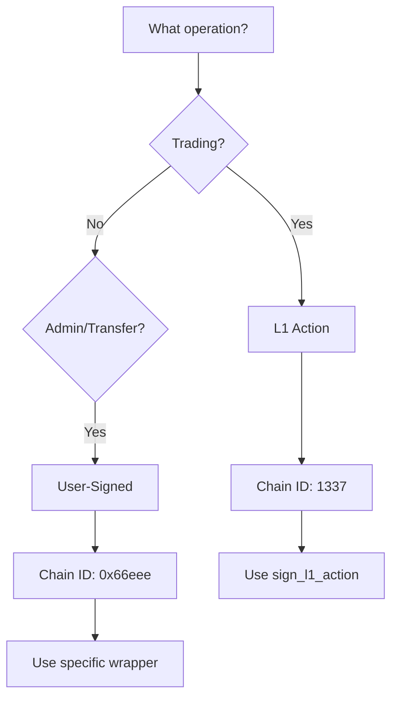

## Quick reference

Hyperliquid uses two distinct signing mechanisms for different purposes:

| Type | Chain ID | Domain | Purpose |
|------|----------|--------|---------|
| **L1 Actions** | 1337 | "Exchange" | Trading operations |
| **User-Signed** | 0x66eee | "HyperliquidSignTransaction" | Admin & transfers |

## Architecture overview

```
L1 Actions → Phantom Agent → ChainId 1337
                ↑
           Agent Wallet (approved via user-signed)
                ↑
User-Signed → Direct EIP-712 → ChainId 0x66eee
```

## L1 Actions

L1 actions use a **phantom agent** construction for trading operations.

### Characteristics
- **Chain ID**: 1337 (NOT Arbitrum's 42161)
- **Domain name**: "Exchange"
- **Serialization**: Msgpack binary format before hashing
- **Agent construction**: Phantom agent from action hash

### Supported actions
All L1 actions use the same `sign_l1_action()` method:
- `order`, `cancel`, `cancelByCloid`
- `modify`, `batchModify`
- `scheduleCancel`
- `updateLeverage`, `updateIsolatedMargin`
- `vaultTransfer`, `subAccountTransfer`

### Example
```python
from hyperliquid.utils.signing import sign_l1_action, get_timestamp_ms

timestamp = get_timestamp_ms()
action = {"type": "order", "orders": [...]}

signature = sign_l1_action(
    wallet,
    action,
    None,  # vault_address
    timestamp,
    None,  # expires_after
    True   # is_mainnet
)
```

## User-Signed actions

User-signed actions use direct EIP-712 signing for administrative operations.

### Characteristics
- **Chain ID**: 0x66eee (421614 in decimal)
- **Domain name**: "HyperliquidSignTransaction"
- **Serialization**: Direct JSON structure
- **No phantom agent**: Direct signing of typed data

### Supported actions
Each action has its own signing wrapper:
- `approveAgent` → `sign_agent()`
- `usdSend` → `sign_usd_transfer_action()`
- `spotSend` → `sign_spot_transfer_action()`
- `withdraw` → `sign_withdraw_from_bridge_action()`
- `approveBuilderFee` → `sign_approve_builder_fee()`
- `usdClassTransfer` → `sign_usd_class_transfer_action()`
- `tokenDelegate` → `sign_token_delegate_action()`

### Example
```python
from hyperliquid.exchange import Exchange
from hyperliquid.utils import constants

exchange = Exchange(
    wallet=master_wallet,
    base_url=constants.MAINNET_API_URL
)

# Approve an agent wallet
result, agent_key = exchange.approve_agent("bot_v1")
```

## Key concepts

### Phantom Agent
A cryptographic construct (not a real wallet) for L1 actions:
1. Action serialized with msgpack
2. Nonce and vault address appended
3. Data hashed with keccak256
4. Temporary "agent" object created with hash as connectionId
5. This phantom agent is signed via EIP-712

### Agent Wallet
A separate keypair authorized to sign L1 actions:
- **Stateless**: No funds or positions
- **Nonce isolation**: Independent nonce tracking
- **Limited scope**: Can only sign L1 actions, not transfers
- **Created via**: User-signed `approveAgent` action

## SDK support

<Note>
The Hyperliquid Python SDK v0.18.0+ handles all signing complexity internally. You don't need to implement the low-level signing logic manually.
</Note>

Connect to a [reliable Hyperliquid RPC endpoint](https://chainstack.com/build-better-with-hyperliquid/) to get started.

### Installation

```bash
pip install hyperliquid-python-sdk
```

### Configuration

Create a `config.json` file:

```json
{
    "private_key": "0x...",
    "account_address": "0x..."
}
```

## Common pitfalls

<Warning>
The most common error is using the wrong chain ID. Always use:
- Chain ID **1337** for L1 actions (trading)
- Chain ID **0x66eee** for user-signed actions (admin)
Never use Arbitrum's chain ID (42161) for Hyperliquid signatures.
</Warning>

## Decision flowchart



## Related guides

- [L1 Action signing guide](/docs/hyperliquid-l1-action-signing) — Detailed guide for trading operations
- [User-signed actions guide](/docs/hyperliquid-user-signed-actions) — Complete guide for administrative operations

- [Authentication guide](/docs/hyperliquid-authentication-guide) — Overview of authentication mechanisms
