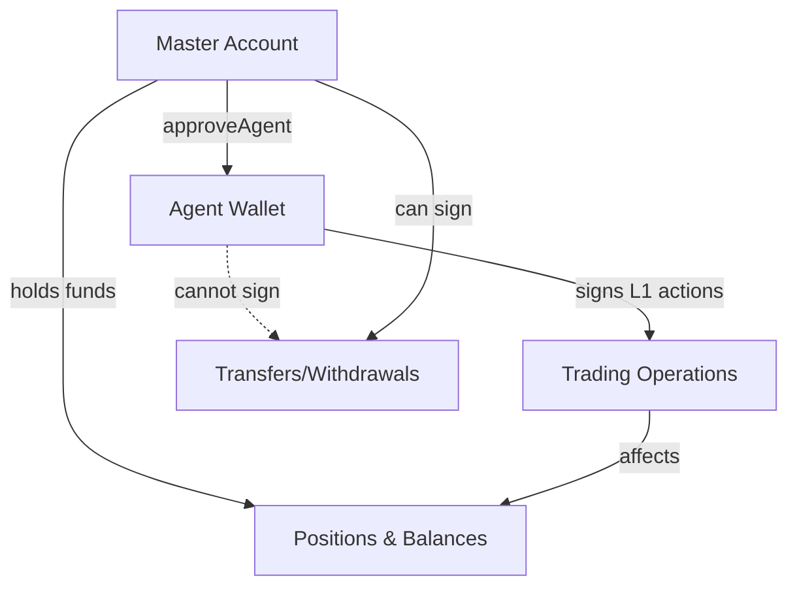

## Technical overview

User-signed actions use **direct EIP-712 signing** without phantom agent abstraction. These are used for administrative operations like approving agents, transferring funds, and managing withdrawals.

<Note>
The Hyperliquid Python SDK v0.18.0+ provides wrapper functions for all user-signed actions, handling the EIP-712 complexity internally.
</Note>

Connect to a [reliable Hyperliquid RPC endpoint](https://chainstack.com/build-better-with-hyperliquid/) to get started with user-signed actions.

## Key characteristics

| Property | Value |
|----------|-------|
| **Chain ID** | 0x66eee (421614 in decimal) |
| **Domain name** | "HyperliquidSignTransaction" |
| **Version** | "1" |
| **Serialization** | Direct JSON structure |
| **Agent type** | No phantom agent - direct signing |

## Agent wallets explained

Agent wallets are separate keypairs authorized to sign L1 actions on behalf of your account:

### Properties
- **Stateless** — No funds or positions held
- **Nonce isolation** — Independent nonce tracking from master account
- **Limited scope** — Can only sign L1 actions, not transfers or withdrawals
- **Revocable** — Can be revoked by the master account

### Use cases
- **Trading bots** — Automated trading without exposing master key
- **API integrations** — Third-party services can trade for you
- **Security isolation** — Limit exposure if agent key is compromised

## Supported user-signed actions

Each action has its own signing wrapper function, but all use `sign_user_signed_action()` internally:

| Action | SDK Method | Purpose |
|--------|------------|---------|
| `approveAgent` | `sign_agent()` | Authorize agent wallet |
| `usdSend` | `sign_usd_transfer_action()` | Transfer USDC |
| `spotSend` | `sign_spot_transfer_action()` | Transfer spot tokens |
| `withdraw` | `sign_withdraw_from_bridge_action()` | Withdraw to L1 |
| `approveBuilderFee` | `sign_approve_builder_fee()` | Approve builder fees |
| `usdClassTransfer` | `sign_usd_class_transfer_action()` | Transfer between classes |
| `tokenDelegate` | `sign_token_delegate_action()` | Delegate tokens |

## Complete agent approval example

This example shows how to create and approve an agent wallet:

```python
#!/usr/bin/env python3
"""
User-Signed Action Example - Agent Approval using SDK
SDK v0.18.0+
"""

from hyperliquid.exchange import Exchange
from hyperliquid.utils import constants
from eth_account import Account
import json

def main():
    # Load configuration
    with open('config.json') as f:
        config = json.load(f)
    
    master_wallet = Account.from_key(config['private_key'])
    print(f"Master account: {master_wallet.address}")
    
    # Initialize exchange
    exchange = Exchange(
        wallet=master_wallet,
        base_url=constants.MAINNET_API_URL
    )
    
    # Create and approve agent using SDK's built-in method
    # This handles all the user-signed action complexity internally
    print("\nCreating and approving new agent...")
    result, agent_key = exchange.approve_agent("bot_v1")
    
    print(f"\nApproval result: {result}")
    
    if result.get('status') == 'ok':
        agent_wallet = Account.from_key(agent_key)
        print(f"✓ Agent approved successfully!")
        print(f"  Agent address: {agent_wallet.address}")
        print(f"  Agent key: {agent_key}")
        
        # Save agent credentials
        with open('agent.json', 'w') as f:
            json.dump({
                "agent_address": agent_wallet.address,
                "agent_private_key": agent_key,
                "master_address": master_wallet.address
            }, f, indent=2)
        
        # Now agent can sign L1 actions for master
        agent_exchange = Exchange(
            wallet=agent_wallet,
            base_url=constants.MAINNET_API_URL,
            account_address=master_wallet.address  # Target master's account
        )
        print(f"\nAgent ready to sign L1 actions for {master_wallet.address}")

if __name__ == "__main__":
    main()
```

## Using an approved agent

Once an agent is approved, it can perform L1 actions on behalf of the master:

```python
# Load agent credentials
with open('agent.json') as f:
    agent_config = json.load(f)

agent_wallet = Account.from_key(agent_config['agent_private_key'])

# Create exchange instance for agent
# Note: account_address points to master's account
agent_exchange = Exchange(
    wallet=agent_wallet,
    base_url=constants.MAINNET_API_URL,
    account_address=agent_config['master_address']
)

# Agent can now place orders for master account
order_result = agent_exchange.order(
    coin="BTC",
    is_buy=True,
    sz=0.01,
    limit_px=50000,
    order_type={"limit": {"tif": "Gtc"}},
    reduce_only=False
)
```

## USDC transfer example

Transfer USDC between accounts using user-signed action:

```python
from hyperliquid.exchange import Exchange
from hyperliquid.utils import constants
from eth_account import Account

# Initialize exchange
exchange = Exchange(
    wallet=wallet,
    base_url=constants.MAINNET_API_URL
)

# Transfer 100 USDC to another address
result = exchange.usd_transfer(
    destination="0x...",  # Recipient address
    amount=100.0
)

print(f"Transfer result: {result}")
```

## Withdrawal example

Withdraw funds to Layer 1:

```python
# Withdraw 50 USDC to Arbitrum
result = exchange.withdraw(
    amount=50.0,
    destination="0x..."  # L1 address
)

print(f"Withdrawal initiated: {result}")
```

## Technical implementation

### EIP-712 structure for agent approval

```python
# Types definition (handled internally by SDK)
AGENT_SIGN_TYPES = [
    {"name": "hyperliquidChain", "type": "string"},
    {"name": "agentAddress", "type": "address"},
    {"name": "agentName", "type": "string"},
    {"name": "nonce", "type": "uint64"}
]

# Example message
message = {
    "hyperliquidChain": "Mainnet",
    "agentAddress": "0x...",
    "agentName": "bot_v1",
    "nonce": 1234567890123
}
```

### EIP-712 structure for USDC transfer

```python
# Types definition
USD_SEND_TYPES = [
    {"name": "hyperliquidChain", "type": "string"},
    {"name": "destination", "type": "string"},
    {"name": "amount", "type": "string"},
    {"name": "time", "type": "uint64"}
]

# Example message
message = {
    "hyperliquidChain": "Mainnet",
    "destination": "0x...",
    "amount": "100.5",
    "time": 1234567890123
}
```

### Domain configuration

All user-signed actions use this domain:

```python
domain = {
    "name": "HyperliquidSignTransaction",
    "version": "1",
    "chainId": 0x66eee,  # 421614 in decimal
    "verifyingContract": "0x0000000000000000000000000000000000000000"
}
```

## TypeScript implementation

```typescript
import { ethers } from 'ethers';

async function signUserAction(
  privateKey: string,
  primaryType: string,
  types: any,
  message: any
): Promise<{ r: string; s: string; v: number }> {
  
  // Domain for user-signed actions
  const domain = {
    name: 'HyperliquidSignTransaction',
    version: '1',
    chainId: 0x66eee,  // User-signed always use this
    verifyingContract: '0x0000000000000000000000000000000000000000'
  };
  
  const wallet = new ethers.Wallet(privateKey);
  const signature = await wallet._signTypedData(domain, types, message);
  
  return ethers.utils.splitSignature(signature);
}

// Example: Approve agent
async function approveAgent(
  privateKey: string,
  agentAddress: string,
  agentName: string
) {
  const types = {
    'HyperliquidTransaction:ApproveAgent': [
      { name: 'hyperliquidChain', type: 'string' },
      { name: 'agentAddress', type: 'address' },
      { name: 'agentName', type: 'string' },
      { name: 'nonce', type: 'uint64' }
    ]
  };
  
  const message = {
    hyperliquidChain: 'Mainnet',
    agentAddress: agentAddress,
    agentName: agentName,
    nonce: Date.now()
  };
  
  return await signUserAction(
    privateKey,
    'HyperliquidTransaction:ApproveAgent',
    types,
    message
  );
}
```

## Agent architecture diagram



## Security best practices

<Check>
**Agent wallet security**
- Generate unique agent keys for each integration
- Store agent keys separately from master keys
- Regularly rotate agent keys
- Monitor agent activity
- Revoke unused agents promptly
</Check>

<Warning>
**Critical limitations**
- Agents CANNOT transfer funds
- Agents CANNOT withdraw to L1
- Agents CANNOT approve other agents
- Agents CAN place and cancel orders
- Agents CAN modify leverage
</Warning>

## Common use cases

### Trading bot deployment

<Steps>
  <Step title="Create agent">
    Generate a new agent wallet for your bot
  </Step>
  <Step title="Approve agent">
    Use master account to approve the agent
  </Step>
  <Step title="Deploy bot">
    Bot uses agent key to sign L1 actions
  </Step>
  <Step title="Monitor activity">
    Track orders and positions created by agent
  </Step>
  <Step title="Revoke if needed">
    Master can revoke agent access anytime
  </Step>
</Steps>

### Multi-account management

```python
# Approve different agents for different strategies
strategies = [
    {"name": "market_maker", "description": "MM bot"},
    {"name": "arbitrage", "description": "Arb bot"},
    {"name": "momentum", "description": "Trend follower"}
]

agents = {}
for strategy in strategies:
    result, agent_key = exchange.approve_agent(strategy["name"])
    if result.get('status') == 'ok':
        agents[strategy["name"]] = agent_key
        print(f"✓ {strategy['name']} agent approved")
```

## Error handling

### Common errors

| Error | Cause | Solution |
|-------|-------|----------|
| "Invalid chain ID" | Using wrong chain ID | Use 0x66eee for user-signed |
| "Agent already exists" | Duplicate agent name | Use unique agent names |
| "Insufficient funds" | Not enough balance | Check account balance |
| "Invalid signature" | Wrong signing method | Use proper EIP-712 structure |

### Example error handling

```python
try:
    result, agent_key = exchange.approve_agent("bot_v1")
    if result.get('status') == 'ok':
        print("Agent approved successfully")
    else:
        print(f"Error: {result.get('response', {}).get('error', 'Unknown error')}")
except Exception as e:
    print(f"Failed to approve agent: {e}")
```

## Summary

User-signed actions handle administrative operations on Hyperliquid. They use direct EIP-712 signing with chain ID 0x66eee. The SDK's wrapper functions make it easy to approve agents, transfer funds, and manage your account securely.

## Related resources

- [Hyperliquid signing overview](/docs/hyperliquid-signing-overview) — Quick reference for both signing types
- [L1 action signing guide](/docs/hyperliquid-l1-action-signing) — For trading operations
- [Authentication guide](/docs/hyperliquid-authentication-guide) — Overview of authentication mechanisms